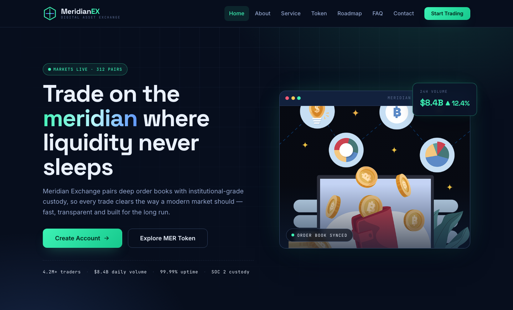

# Meridian Exchange — Crypto Trading Platform

A premium, framework-free HTML template for a digital-asset exchange. A dark navy ground, crypto-mint `#3df2b4` accents and electric blue highlights are driven by Space Grotesk display type, Inter body text and JetBrains Mono for terminal-style details — a serious, institutional-grade home for spot trading, staking, token sales and custody services.

## 📸 Screenshot

## Design System

| Token | Value |
|-------|-------|
| **Ground** | `--clr-bg` `#070e1d` (dark navy), `--clr-ink` `#04070f` (footer) |
| **Panel** | `--clr-panel` `#0d1b33`, `--clr-panel-2` `#12213d` |
| **Primary** | `--clr-brand` `#3df2b4` (crypto mint), `--clr-brand-deep` `#16c98d` |
| **Secondary** | `--clr-blue` `#5b93ff`, `--clr-gold` `#ffc857`, `--clr-red` `#ff5c77` |
| **Text** | `--clr-text` `#eaf1fd`, `--clr-muted` `#93a5cc`, `--clr-faint` `#5d6e95` |
| **Display type** | `Space Grotesk` (sans, 500–700) |
| **Body type** | `Inter` (sans, 400–600) |
| **Mono type** | `JetBrains Mono` (kickers, ticker, terminal) |
| **Container** | 1200px max-width, centered |
| **Breakpoints** | ~1080px (tablet), ~820px (mobile nav), ~640px (mobile) |

## Pages

| Page | File | Description |
|------|------|-------------|
| Home | [index.html](index.html) | Hero with monitor, live ticker, stats, features, terminal, services, token sale, roadmap, FAQ |
| About | [about.html](about.html) | Story, values, milestones, stats |
| Service | [service.html](service.html) | Full service grid, process steps, fee schedule table |
| Token | [token.html](token.html) | MER token sale with countdown, distribution bars, tokenomics table |
| Roadmap | [roadmap.html](roadmap.html) | Vertical timeline of six shipping quarters |
| FAQ | [faq.html](faq.html) | Expandable Q&A accordion |
| Contact | [contact.html](contact.html) | Contact form with `[data-form]` validation, info cards |
| 404 | [404.html](404.html) | Terminal-style on-brand error page |

## Features

- **Framework-free** — pure HTML5, CSS3 (custom properties, Grid, Flexbox, `clamp()`), vanilla JavaScript
- **Trading-terminal aesthetic** — dark navy panels, crypto-mint accents and JetBrains Mono details
- **Fluid responsive** — three breakpoints, no horizontal scroll on any viewport
- **Scroll reveal** — IntersectionObserver-powered `.reveal` animations (respects `prefers-reduced-motion`)
- **Mobile nav** — burger toggle with `aria-expanded` accessible pattern
- **Hero crossfade** — automatic 6s image transition via `.hero-bg img` + `.active` class
- **Live countdown** — token-sale timer built with vanilla JS, powered by `[data-countdown]`
- **Ticker tape** — seamless looping market ticker with `:hover` pause
- **Form validation** — `[data-form]` hook with `.form-ok` / `.form-err` / `.show` toggle
- **Original imagery** — production-quality trading and dashboard photography, no placeholders

## Tech Stack

- HTML5 + CSS3 (W3C-valid, semantic landmarks)
- Vanilla JavaScript (canonical IIFE build)
- Google Fonts (Space Grotesk + Inter + JetBrains Mono)
- SVG favicon (inline data: URI)

## SEO

- Semantic HTML5 structure (`<header>`, `<nav>`, `<main>`, `<section>`, `<footer>`)
- Unique `<title>` and `<meta description>` per page
- `lang="en"` attribute, `charset="utf-8"`, viewport meta
- Alt text on all images

## License

Free for personal and commercial use. Attribution appreciated but not required.

---

## Let's Build Something Together 🚀

[Book a free consultation](https://tally.so/r/q4q1L9)
